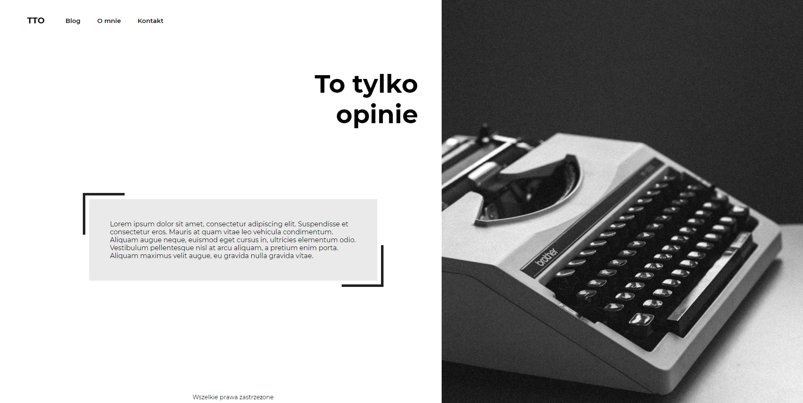
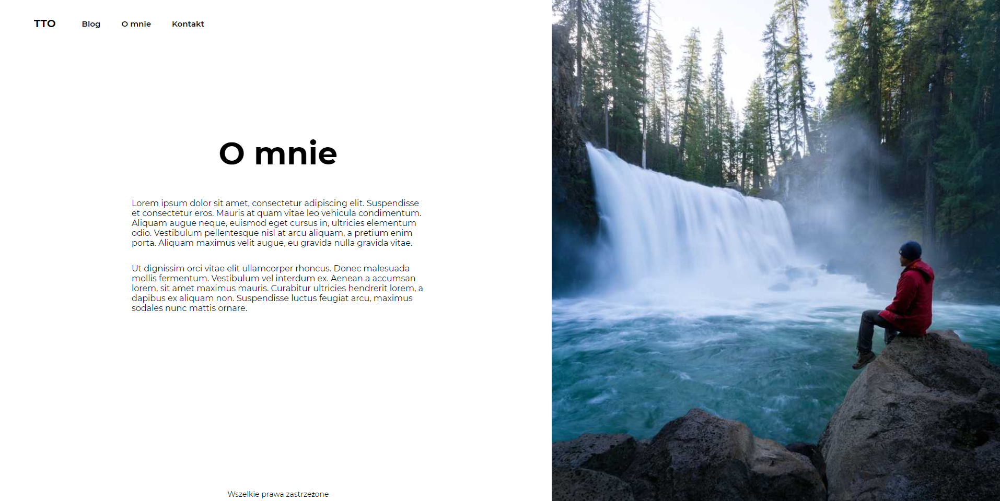
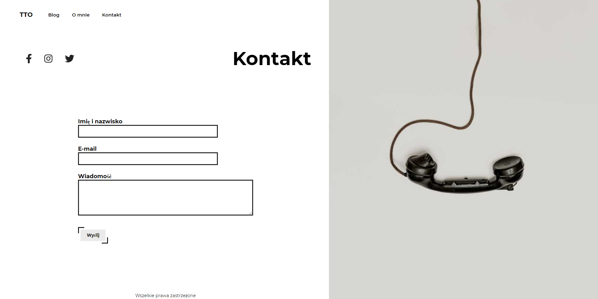

<!-- AUTO-GENERATED-CONTENT:START (STARTER) -->
<p align="center">
 
</p>
<h1 align="center">
  To Tylko Opinie
</h1>


***"To Tylko Opinie"*** is a Blog based on GatsbyJs. On this blog you can 
find reviews from various cultural areas, mainly concerned on music and movie.

Main reason for creating this project was learning ***"GatsbyJS"***. Another reason was creating
blog page for my friend, which will be real working commercial project.

***
###Demo screenshots

-

-

-


***
###Technologies
1. GatsbyJs / ReactJS
1. Styled Components
1. DatoCMs
1. MailGrid + Firebase functions
***
###Opening project


1.  **Start developing.**

    Navigate into your new site’s directory and start it up.

    ```shell
    cd to-tylko-opinie/
    gatsby develop
    ```

1.  **Open the source code and start editing**

    Blog is now running at `http://localhost:8000`

    GraphQL: _`http://localhost:8000/___graphql`_
    
  ***

###Project structure

A quick look at the top-level files and directories you'll see in a Gatsby project.

    .
    ├── node_modules
    ├── src
        ├── assets
        ├── components
        ├── layouts
        ├── pages
    ├── .gitignore
    ├── .prettierrc
    ├── gatsby-browser.js
    ├── gatsby-config.js
    ├── gatsby-node.js
    ├── gatsby-ssr.js
    ├── LICENSE
    ├── package-lock.json
    ├── package.json
    └── README.md

  **`/node_modules`**: This directory contains all of the modules of code that your project depends on (npm packages) are automatically installed.

  **`/src`**: This directory will contain all of the code related to what you will see on the front-end of your site (what you see in the browser) such as your site header or a page template. `src` is a convention for “source code”.

   **`/assets`**: This directory will contain all assets including global styles, global variables and images.
    
   **`/components`**: This directory will contain components
    
   **`/layouts`**: This directory contain two layout files: main layout, which is used on each page from **`/pages`** directory and layout file for blog post. 
    
   **`/pages`**: This directory contains all pages from this blog. 
    

  **`.gitignore`**: This file tells git which files it should not track / not maintain a version history for.
  **`.prettierrc`**: This is a configuration file for [Prettier](https://prettier.io/). Prettier is a tool to help keep the formatting of your code consistent.

  **`gatsby-browser.js`**: This file is where Gatsby expects to find any usage of the [Gatsby browser APIs](https://www.gatsbyjs.org/docs/browser-apis/) (if any). These allow customization/extension of default Gatsby settings affecting the browser.

 **`gatsby-config.js`**: This is the main configuration file for a Gatsby site. This is where you can specify information about your site (metadata) like the site title and description, which Gatsby plugins you’d like to include, etc. (Check out the [config docs](https://www.gatsbyjs.org/docs/gatsby-config/) for more detail).

  **`gatsby-node.js`**: This file is where Gatsby expects to find any usage of the [Gatsby Node APIs](https://www.gatsbyjs.org/docs/node-apis/) (if any). These allow customization/extension of default Gatsby settings affecting pieces of the site build process.

  **`gatsby-ssr.js`**: This file is where Gatsby expects to find any usage of the [Gatsby server-side rendering APIs](https://www.gatsbyjs.org/docs/ssr-apis/) (if any). These allow customization of default Gatsby settings affecting server-side rendering.

  **`LICENSE`**: Gatsby is licensed under the MIT license.

 **`package-lock.json`** (See `package.json` below, first). This is an automatically generated file based on the exact versions of your npm dependencies that were installed for your project. **(You won’t change this file directly).**

 **`package.json`**: A manifest file for Node.js projects, which includes things like metadata (the project’s name, author, etc). This manifest is how npm knows which packages to install for your project.

 **`README.md`**: A text file containing useful reference information about your project.

<!-- AUTO-GENERATED-CONTENT:END -->
